# Chapter 3: Transport Layer

“A central piece of the layered network architecture. It has the
critical role of providing communication services directly to the
application processes running on different hosts.”

## 3.1 Introduction and Transport-Layer Services

- A transport-layer protocol provides for logical communication (as if they are directly connected) between application processes running on different hosts.

- Transport-layer protocols are implemented in the end systems but not in network routers.

- On the sending side, the transport layer converts the application-layer messages it receives from a sending application process into transport-layer packets, known as **transport-layer segments** by **breaking** the application messages into smaller chunks and **adding a transport-layer header** to each chunk to create the transport-layer segment.

- The transport layer then passes the segment to the **network layer** at the sending end system, where the segment is encapsulated within a **network-layer packet (datagram)** and sent to the destination.

- On the receiving side, the network layer extracts the transport-layer segment from the datagram and passes the segment up to the transport layer. The transport layer then processes the received segment, making the data in the segment available to the receiving application.

- The Internet has two transport layer protocols: **TCP and UDP.**

### 3.1.1 Relationship Between Transport and Network Layers

- **Distinction between Transport and Network layer Protocols** : A network-layer protocol provides logical communication **between hosts**, and transport-layer protocol as said above provides the logical communication **between processes** running on different hosts.

- Intermediate routers neither act on, nor recognize, any information that the transport layer may have added to the application messages. And transport-layer protocol doesn’t have any say about how the messages are moved within the network core.

- The services that a transport protocol can provide are often **constrained by the service model of the underlying network-layer protocol.**
  - If the *network-layer protocol cannot provide* delay or bandwidth guarantees for transport-layer segments sent between hosts, then *transport-layer protocol cannot provide* delay or bandwidth guarantees for application messages sent between processes.
  - Nevertheless, certain services can be offered *by a transport protocol* even when the underlying network protocol doesn’t offer the corresponding service at the network layer.(reliable data transfer - security and encryption)

### 3.1.2 Overview of the Transport Layer in the Internet

- **UDP (User Datagram Protocol),** which provides an unreliable,connection-less service to the invoking application.

- **TCP (Transmission Control Protocol)**, which provides a reliable, connection-oriented service to the invoking application.

- The **application developer** must specify one of these two transport protocols.

- The Internet’s network-layer protocol is **IP**, standing for Internet Protocol.
  - The IP service model is a **best-effort delivery service**. This means that IP makes its “best effort” to deliver segments between communicating hosts, **but it makes no guarantees** ( such as guarantees about segment delivery, the orderly delivery of segments,the integrity of the data in segments).
  - **IP is said to be an unreliable service.**
  - Keep in mind every host has at least one network-layer address (**IP address**).

- Main responsibility of Transport-layer protocol is **extending host-to-host delivery to process-to-process delivery** which is called transport-layer **multiplexing and de-multiplexing.**

- UDP and TCP also provide **integrity checking** by including error detection fields in their segments’ headers.

- An application using UDP transport can send at any rate it pleases, for as long as it pleases.UDP only provides the above two minimal services, **UDP is an unreliable service**.

- TCP, on the other hand, offers several additional services to applications. It provides **reliable data transfer.**TCP ensures that data is delivered from sending process to receiving process, correctly and in order. TCP thus converts IP’s unreliable service between end systems into a reliable data transport service between processes.

- TCP also provides **congestion control.** TCP congestion control prevents any one TCP connection from swamping the links and routers between communicating hosts with an excessive amount of traffic. TCP tries to give connections in a congested link an equal share of the link bandwidth.

## 3.2 Multiplexing and De-multiplexing

- At the *destination host*, the transport layer receives segments from the network layer just below. The transport layer has the responsibility of delivering the data in these segments to the appropriate application process running in the host.

- A *process* can have one or more sockets, doors through which data passes from the network to the process and vice versa.

- Thus, The transport layer in the *receiving host* does not actually deliver data directly to a process, but instead to an intermediary socket. Because at any given time there can be more than one socket in the receiving host, each socket has a **unique identifier** (its format depends on UDP or TCP).

- Each transport-layer segment has a set of fields in the segment that are examined by transport-layer to identify the receiving socket and then it directs the segment to that socket.

- **De-multiplexing:** The job of delivering the data in a transport-layer segment to the correct socket.

- **Multiplexing:** The job of gathering data chunks at the source host from different sockets, encapsulating each data chunk with header information to create segments, and passing the segments to the network layer.

- **Multiplexing Requirements:**
  - Sockets have *unique identifiers*.
  - Each segment have special fields that indicate the socket to which the segment is to be delivered. Those **are the source port number field and the destination port number field.**

  

- Each port number is a 16-bit number, ranging from 0 to 65535. The port numbers ranging from 0 to 1023 are called **well-known port numbers** and are restricted/reserved for use by well-known application protocols such as HTTP (80). 

- The list of well-known port numbers is given in RFC 1700 and is updated in [here](http://www.iana.org).

- Summary:
  - Each socket in the host could be assigned a port number.

  - When a segment arrives at the host, the transport layer examines the destination port number in the segment and directs the segment to the corresponding socket.

  - The segment’s data then passes through the socket into the attached process.”

We discuss multiplexing and de-multiplexing for both UDP then TCP.

---

### Connection-less Multiplexing and De-multiplexing (UDP)

- When a UDP socket is created, the transport layer automatically assigns a port number to the socket in the range 1024 to 65535 that is currently not being used by any other UDP port in the host.

- Typically, the **client side of the application** lets the transport layer automatically (and transparently) **assign the port number**, whereas the **server side** of the application assigns **a specific port number.**

- A UDP socket is fully identified by a **two-tuple** consisting of a destination IP address and a destination port number.

- As a consequence, if two UDP segments have different source IP addresses and/or source port numbers, but have the same destination IP address and destination port number, then the two segments will be directed to the same destination process via the same destination socket.

### Connection-Oriented Multiplexing and De-multiplexing

- A TCP socket is identified by a **four-tuple:** (source IP address, source port number, destination IP address, destination port number).

- Thus, when a TCP segment arrives from the network to a host, the host uses all four values to direct (de-multiplex) the segment to the appropriate socket.

- Two arriving TCP segments with different source IP addresses or source port numbers will (with the exception of a TCP segment carrying the original connection-establishment request) be directed to two different sockets.

- Scenario:

  - Host C initiates two HTTP sessions to server B.

  - Host A initiates one HTTP session to B.

  - Hosts A and C and server B each have their own unique IP address.

  - Host C assigns two different source port numbers (26145 and 7532) to its two HTTP connections.

  - Because Host A is choosing source port numbers independently of C, it might also assign a source port of 26145 to its HTTP connection.

  - But this is not a problem—server B will still be able to correctly de-multiplex the two connections having the same source port number, since the two connections have different source IP addresses.

### Web Servers and TCP

There is not always a one-to-one correspondence between connection sockets and processes.

In fact, today’s high-performing Web servers often use only one process, and create a new thread with a new connection socket for each new client connection.

## 3.3 Connection-less Transport: UDP

- UDP, defined in **\[RFC 768\]**, does just about as little as a transport protocol can do.

- That means if an application developer chooses UDP instead of TCP, then the application is almost directly talking with IP.

- With UDP there is no handshaking between sending and receiving transport-layer entities before sending a segment. So, **UDP is said to be connection-less.**

### Message Lifecycle with UDP (Interview Question)

1. UDP takes messages from the application process, attaches source and destination port number fields for the multiplexing/de-multiplexing service, adds two other small fields, and passes the resulting segment to the network layer.

2. The network layer encapsulates the transport-layer segment into an IP datagram and then makes a best-effort attempt to deliver the segment to the receiving host.

3. If the segment arrives at the receiving host, UDP uses the destination port number to deliver the segment’s data to the correct application process.

### Why/When to use UDP

1. **Finer application-level control over what data is sent, and when.**
   - Under UDP, as soon as an application process passes data to UDP, UDP will package the data inside a UDP segment and immediately pass the segment to the network layer.

   - TCP, on the other hand, has a congestion-control mechanism that throttles the transport-layer TCP sender when one or more links between the source and destination hosts become excessively congested.

   - TCP will also continue to resend a segment until the receipt of the segment has been acknowledged by the destination, regardless of how long reliable delivery takes.

   - Since **real-time applications** often require a **minimum sending rate**, do not want to overly delay segment transmission, and **can tolerate some data loss.**

2. **No connection establishment.**

   - TCP uses a three-way handshake before it starts to transfer data.
   - UDP just starts. Thus UDP does not introduce any delay to establish a connection.

3. **No connection state.**

   - TCP maintains connection state in the end systems.  This connection state includes receive and send buffers, congestion-control parameters, and sequence and acknowledgment number parameters.

   - UDP, on the other hand, does not maintain connection state and does not track any of these parameters.

4. **Small packet header overhead.**
  
   - The TCP segment has 20 bytes of header overhead in every segment, whereas UDP has only 8 bytes of overhead.

However, it is possible for an application to have reliable data transfer when using UDP. This can be done if reliability is built into the application itself.

---

### 3.3.1 UDP Segment Structure

- The **application data** occupies the **data field of the UDP segment.**

- The UDP header has only **four fields**, each consisting of **two bytes.**

- **Port numbers** allow de-multiplexing process to occur.

- The **length field** specifies the number of bytes in the UDP segment, needed since the size of the data field may differ from one UDP segment to the next.

- The **checksum** is used by the receiving host to check whether errors have been introduced into the segment.

---

### 3.3.2 UDP Checksum

The checksum is used for **Integrity** to determine whether bits within the UDP segment have been altered as it moved from source to destination.

**At the sender side:**

- Performs the 1s complement of the sum of all the 16-bit words in the segment.
- Any overflow encountered during the sum being wrapped around.
- This result is put in the checksum field of the UDP segment.

**At the receiver:**

- All four 16-bit words are added, including the checksum.
- If no errors are introduced into the packet, then clearly the sum at the receiver will be 1111111111111111.
- If one of the bits is a 0, then we know that errors have been introduced into the packet.

---

## 3.4 Principles of Reliable Data Transfer

“The general problem of Reliable Data Transfer is of central importance
to networking. Indeed, if one had to identify a “top-ten” list of
fundamentally important problems in all of networking, this would be a
candidate to lead the list.”

- With a reliable channel, no transferred data bits are corrupted (flipped from 0 to 1, or vice versa) or lost, and all are delivered in the order in which they were sent.

- It is the responsibility of a **reliable data transfer protocol** to implement this service abstraction provided to the upper-layer entities.

- Note that the layer below the reliable data transfer protocol may be unreliable.

- We will **incrementally develop** the sender and receiver sides of a reliable data transfer protocol, **considering increasingly complex models** of the underlying channel.

- The sending side of the data transfer protocol will be invoked from above by a call to rdt\_send(). It will pass the data to be delivered to the upper layer at the receiving side.

- On the receiving side, rdt\_rcv() will be called when a packet arrives from the receiving side of the channel. When the rdt protocol wants to deliver data to the upper layer, it will do so by calling deliver\_data().

- Both the send and receive sides of rdt send packets to the other side by a call to udt\_send()

- For now, We consider only the case of unidirectional data transfer, that is, data transfer from the sending to the receiving side.

- It is important to note that the sending and receiving sides of our protocol will nonetheless need to transmit packets in both directions, as indicated in Figure 3.8.

---

### 3.4.1 Building a Reliable Data Transfer Protocol

We first consider the simplest case, in which the underlying channel is completely reliable. Nothing can go wrong !

#### RDT 1.0: Reliable Data Transfer over a Perfectly Reliable Channel

- We have also assumed that the receiver is able to receive data as fast as the sender happens to send data. Thus, there is no need for the receiver to ask the sender to slow down!

- The finite-state machine (FSM) definitions for the rdt1.0 sender and receiver are shown in Figure 3.9.

- The sending side of rdt simply accepts data from the upper layer via the **rdt\_send(data)** event, creates a packet containing the data via **make\_pkt(data)** and sends the packet into the channel.

- On the receiving side, rdt receives a packet from the underlying channel via the **rdt\_rcv(packet)** event, removes the data from the packet via **extract (packet, data)** and passes the data up to the upper layer via **deliver\_data(data)**

Next we move to a more realistic model of the underlying channel is one in which bits in a packet may be corrupted.

---

#### RDT 2.0: Reliable Data Transfer over a Channel with Bit Errors [STOP AND WAIT PROTOCOL]

- We’ll continue to assume for the moment that all transmitted packets are received (although their bits may be corrupted) in order of sending.

- The message-dictation protocol **uses both positive acknowledgments (ACK) and negative acknowledgments (NAK).** These control messages allow the receiver to let the sender know what has been received correctly, and what has failed.

- In a computer network setting,reliable data transfer protocols based on such retransmission are known as **ARQ (Automatic Repeat Request) protocols.**

- Three additional protocol capabilities are required in ARQ protocols to handle the presence of bit errors:
  - **Error detection.** First, a mechanism is needed to allow the
 receiver to detect when bit errors have occurred.

  - **Receiver feedback.** Our rdt2.0 protocol will similarly send ACK and NAK packets back from the receiver to the sender. In principle, these packets need only be one bit long; for example, a 0 value could indicate a NAK and a value of 1 could indicate an ACK.

  - **Retransmission.** A packet that is received in error at the receiver will be retransmitted by the sender.

#### The Sending Side

In the **leftmost state**, the send-side protocol is waiting for data to be passed down from the upper layer.

When the **rdt\_send(data)** event
occurs, the sender will create a packet  (sndpkt) containing the data to
be sent, along with a packet checksum and then send the packet via the **udt\_send(sndpkt)** operation.

In the **rightmost state**, the sender protocol is waiting for an ACK or
a NAK packet from the receiver.

If an ACK packet is received, the sender
knows that the most recently transmitted packet has been received
correctly and thus the protocol returns to the state of waiting for data
from the upper layer.

If a NAK is received, the protocol retransmits the last packet and waits for an ACK or NAK to be returned by the receiver
in response to the retransmitted data packet.

Thus, the sender will not send a new piece of data until it is sure that
the receiver has correctly received the current packet.

#### The Receiving Side

On packet arrival,the receiver replies with either an ACK or a NAK,
depending on whether or not the received packet is corrupted.

#### Fatal Flaw in RDT 2.0

We haven’t accounted for the possibility that the ACK or NAK packet
could be corrupted!

The difficulty here is that if an ACK or NAK is corrupted, the sender
has no way to know whether or not the receiver has correctly received
the last piece of transmitted data.

An approach is for the sender simply to **resend the current data packet** when it receives a garbled ACK or NAK packet.

This approach, however, introduces **duplicate packets** into the sender-to-receiver channel. The fundamental difficulty with duplicate packets is that the receiver doesn’t know whether the ACK or NAK it last sent was received correctly at the sender. Thus, it cannot know a priori whether an arriving packet contains new data or is a retransmission!

A simple solution to this new problem is to **add a new field** to the data packet and have the sender number its data packets **by putting a sequence number** into this field. The receiver then need only check this sequence number to determine whether or not the received packet is a retransmission. For this simple case of a  protocol, a 1-bit sequence number will suffice.

Since we are currently assuming a channel that does not lose packets, ACK and NAK packets do not themselves need to indicate the sequence number of the packet they are acknowledging.

The sender knows that a received ACK or NAK packet (whether garbled or not) was generated in response to its most recently transmitted data packet.

---

#### RDT 2.1: Reliable Data Transfer over a Channel with Bit Errors

- The sender and receiver FSMs each now have twice as many states as before because the protocol state must now reflect whether the packet currently being sent (by the sender) or expected (at the receiver) should have a sequence number of 0 or 1. Actions in state for Seq. number 0 are the same for states for Seq. number 1

- Protocol rdt2.1 uses both positive and negative acknowledgments from the receiver to the sender.

- When an out-of-order packet is received, the receiver sends a positive acknowledgment for the packet it has received.

- When a corrupted packet is received, the
receiver sends a negative acknowledgment.

---

#### RDT 2.2: Reliable Data Transfer over a Channel with Bit Errors

- Instead of sending a NAK, we send an ACK for the last correctly received packet. A sender that receives two ACKs for the same packet (that is, receives **duplicate ACKs**) knows that the receiver did not correctly receive the packet following the packet that is being ACK’ed twice.

- The receiver must now include the sequence number of the packet being acknowledged by an ACK packet and the sender must check the number with ACK.

---

### RDT 3.0: Reliable Data Transfer over a Lossy Channel with Bit Errors

- Suppose now that in addition to corrupting bits, the underlying channel can lose packets as well.

- Two additional concerns must now be addressed by the protocol: how to detect packet loss and what to do when packet loss occurs.

- Here, we’ll put the burden of **detecting and recovering from lost packets** on the **sender.**

- How long must the sender wait to be certain that something has been lost?
  - Sender must wait at least as long as a round-trip delay between the sender and receiver (which may include buffering at intermediate routers),

  - PLUS whatever amount of time is needed to process a packet at the receiver.

  - The problem is this **worst-case maximum delay is very difficult even to estimate.**

Moreover, the protocol should ideally recover from packet fastly as possible; waiting for a worst-case delay **could mean a long wait until error recovery is initiated.**

- **The practical approach** is for the sender to **judiciously choose a time value** such that packet loss is likely, although not guaranteed, to have happened. And if an ACK is not received within this time, the packet is **retransmitted.**

- **Premature Timeouts case.** If a packet experiences a particularly large delay, the sender may retransmit the packet even though neither the data packet nor its ACK have been lost.

- This introduces the possibility of **duplicate data packets** in the channel. Implementing a **time-based retransmission mechanism** requires a **countdown timer** that can interrupt the sender after a given amount of time has expired.

- The sender will thus need to be able to:
  1. Start the timer each
     time a packet (either a first-time packet or a retransmission) is
     sent,
  2. Respond to a timer interrupt (taking appropriate actions),
  3. Stop the timer.
  
- Because packet sequence numbers alternate between 0 and 1, protocol rdt3.0 is sometimes known as the **alternating-bit protocol.**

- The receiver in protocol rdt2.2 will also work as the receiver in protocol rdt 3.0.

---

### 3.4.2 Pipelined Reliable Data Transfer Protocols

#### Problem

- **Why we need to improve ?** Rdt3.0’s performance problem is the fact that it is a stop-and-wait protocol.

- Take the example in picture below of two hosts where the RTT, between those 2 end systems is approximately 30 milliseconds. Suppose that they are connected by a channel with a transmission rate, R, of 1 Gbps (10^9 bits per second). With a packet size, L, of 1,000 bytes (8,000 bits) per packet, including both header fields and data.

- That is, the sender was busy only 2.7 hundredths of one percent of the time, the sender was able to send only 1,000 bytes in 30.008 ms, an effective throughput of only 267 kbps even though a 1 Gbps link was available!

- Also,we have neglected lower layer protocol-processing times at the sender and receiver, as well as the processing and queuing delays that would occur at any intermediate routers between the sender and receiver, all theses gets the performance worse.

#### Solution

- Rather than operate in a stop-and-wait manner, the sender is allowed to send multiple packets without waiting for acknowledgments. the utilization of the sender is essentially tripled, this technique is known as **pipelining.**

- The range of sequence numbers must be increased, since each in-transit packet (not counting retransmissions) must have a unique sequence number and there may be multiple, in-transit, unacknowledged packets.

- The sender and receiver sides of the protocols may have to buffer more than one packet. Minimally, the sender will have to buffer packets that have been transmitted but not yet acknowledged. Buffering of correctly received packets may also be needed at the receiver.

- Two basic approaches toward pipelined error recovery can be identified: **Go-Back-N and selective repeat.**

---

### 3.4.3 Go-Back-N (GBN) or The Sliding Window Protocol

#### Sender

- Sender is allowed to transmit multiple packets (when available)  without waiting for an acknowledgment, but is constrained to have no more than some maximum allowable number, N, of unacknowledged packets in the pipeline.

- **base:** the sequence number of the oldest unacknowledged

- **nextseqnum:** the smallest unused sequence number or the sequence
number of the next packet to be sent.

- The range of permissible sequence numbers for transmitted but not yet acknowledged packets can be viewed as a window of size N over the range of sequence numbers.

- If k is the number of bits in the packet sequence number field, the range of sequence numbers is thus \[0,2^k-1\]. 

- With a finite range of sequence numbers, all arithmetic involving sequence numbers must then be done using modulo 2^k arithmetic.

- The GBN sender must respond to three types of events:
  1. Invocation from above.
  2. Receipt of an ACK.
  3. A timeout event.

- An acknowledgment for a packet with sequence number n will be taken to be a **cumulative acknowledgment**, indicating that all packets with a sequence number up to and including n have been correctly received at the receiver.

- The use of cumulative acknowledgments is a ***natural choice*** for GBN because the nature of delivery of packets from the upper layer. If packet with sequence number k is delivered, those lower than k must be also delivered.

- Our sender **uses only a single timer,** which can be thought of as a timer for the oldest transmitted but not yet acknowledged packet.

#### Reciever

- If an ACK is received but there are still additional transmitted but not yet acknowledged packets, the timer is **restarted**. If there are no outstanding, unacknowledged packets, the timer is **stopped.**

- In our GBN protocol, the receiver discards out-of-order packets.

- Since retransmission rule will retransmit any delivered but out of order packets. Advantage of this approach is the simplicity of receiver buffering, the receiver need not buffer any out-of-order packets.

- Of course, the disadvantage of throwing away a correctly received packet is that the subsequent retransmission of that packet might be lost or garbled and thus even more retransmissions would be required.

#### GBN Scenario

Figure above shows the operation of the GBN protocol for the case of a window size of four packets. Because of this window size limitation, the sender sends packets 0 through 3 but then must wait for one or more of these packets to be acknowledged before proceeding.

As each successive ACK (for example, ACK0 and ACK1) is received, the window slides forward and the sender can transmit one new packet (pkt4 and pkt5, respectively). On the receiver side, packet 2 is lost and thus packets 3, 4, and 5 are found to be out of order and are discarded.

---

### 3.4.4 Selective Repeat (SR)

- There are scenarios in which GBN suffers from performance problems.

- In particular, when the window size and bandwidth-delay product are both large, many packets can be in the pipeline. A single packet error can cause GBN to retransmit a large number of packets, many unnecessarily.

- Selective-repeat protocols avoid unnecessary retransmissions by having the sender retransmit only those packets that it suspects were received in error. The receiver individually acknowledge correctly received packets.

- A window size of N will again be used to limit the number of outstanding, unacknowledged packets in the pipeline.

- The receiver will acknowledge a correctly received packet whether or not it is in order. Out-of-order packets are buffered until any missing packets (that is, packets with lower sequence numbers) are  received, at which point a batch of packets can be delivered in order to the upper layer.

- Receiver re-acknowledges (rather than ignores) already received packets with certain sequence numbers below the current window base.

- The sender and receiver will not always have an identical view of what has been received correctly and what has not. For SR protocols, this means that the sender and receiver windows will not always coincide.

#### SR Sender and Receiver Actions

#### Lack Of Synchronization

We discuss two cases where synchronization is an issue.

- **First Case:**

The ACKs for the first three packets are lost and the sender retransmits these packets. The receiver thus next receives a packet with sequence number 0—a copy of the first packet sent.

Note that the receiver cannot “see” the actions taken by the sender. All the receiver observes is the sequence of messages it receives from the channel and sends into the channel.

- **Second Case:**

The ACKs for the first three packets are all delivered correctly. The sender thus moves its window forward and sends the fourth, fifth, and sixth packets, with sequence numbers 3, 0, and 1, respectively. The packet with sequence number 3 is lost, but the packet with sequence number 0 arrives—a packet containing new data.

- For the Receiver, There is no way of distinguishing the retransmission of the first packet from an original transmission of the fifth packet.

- Clearly, a window size that is 1 less than the size of the sequence number space won’t work. what relationship between seq size and window size to avoid this problem ?

#### SR Scenario

---

## 3.5 Connection-Oriented Transport: TCP

### Summary of reliable data transfer mechanisms and their use

-   In order to provide reliable data transfer, TCP relies on many of
     the underlying principles discussed in the previous section,
     including error detection, retransmissions, cumulative
     acknowledgments, timers, and header fields for sequence and
     acknowledgment numbers.

-   TCP is defined in RFC 793, RFC 1122, RFC 1323, RFC 2018, and
     RFC 2581.

***3.5.1 The TCP Connection***

-   TCP is ***connection-oriented*** because before one application
     process can begin to send data to another, the two processes must
     first ***“handshake”*** with each other—that is, they must send
     some preliminary segments to each other to establish the
     parameters of the ensuing data transfer.

-   As part of TCP connection establishment, both sides of the
     connection will initialize many TCP state variables associated
     with the TCP connection.

-   TCP protocol ***runs only in the end systems*** and not in the
     intermediate network elements (routers and link-layer switches),
     the intermediate network elements do not maintain TCP connection
     state. In fact, the intermediate routers are completely oblivious
     to TCP connections; they see datagrams, not connections.

-   A TCP connection provides a ***full-duplex service***: If there is a
     TCP connection between Process A on one host and Process B on
     another host, then application-layer data can flow from Process A
     to Process B at the same time as application-layer data flows from
     Process B to Process A.

-   A TCP connection is also always ***point-to-point,*** that is,
     between a single sender and a single receiver. So-called
     “multicasting” is not possible with TCP.

-   How is this connection done ?

-   The client first sends a special TCP segment (NO DATA/ PAYLOAD)

-   The server responds with a second special TCP segment (NO DATA/
     PAYLOAD)

-   Finally the client responds again with a third special segment. (MAY
     HAVE DATA)

-   This connection-establishment procedure is often referred to as a
     ***three-way handshake.***

-   Once a TCP connection is established, the two application processes
     can send data to each other. The client process passes a stream of
     data through the socket. TCP directs this data to the connection’s
     send buffer, which is one of the buffers that is set aside during
     the initial three-way handshake. From time to time, TCP will grab
     chunks of data from the send buffer and pass the data to the
     network layer.

-   The maximum amount of (application layer) data (not including
     headers) that can be grabbed and placed in a segment is limited by
     the **maximum segment size (MSS). **

-   The MSS is typically **set by first determining the length of the
     largest link-layer frame** that can be sent by the local sending
     host (the so-called maximum transmission unit, MTU), and then
     setting the MSS to ensure that a TCP segment (when encapsulated in
     an IP datagram) plus the TCP/IP header length (typically 40 bytes)
     will fit into a single link-layer frame. Both Ethernet and PPP
     link-layer protocols have an MTU of 1,500 bytes. Thus a typical
     value of MSS is 1460 bytes.

-   TCP pairs each chunk of client data with a TCP header, thereby
     forming TCP segments. The segments are passed down to the network
     layer, where they are separately encapsulated within network-layer
     IP datagrams. The IP datagrams are then sent into the network.

-   When TCP receives a segment at the other end, the segment’s data is
     placed in the TCP connection receive buffer. The application reads
     the stream of data from this buffer. Each side of the connection
     has its own send buffer and its own receive buffer.

-   A TCP connection consists of buffers, variables, and a socket
     connection to a process in one host, and another set of buffers,
     variables, and a socket connection to a process in another host.

***3.5.2 TCP Segment
Structure***

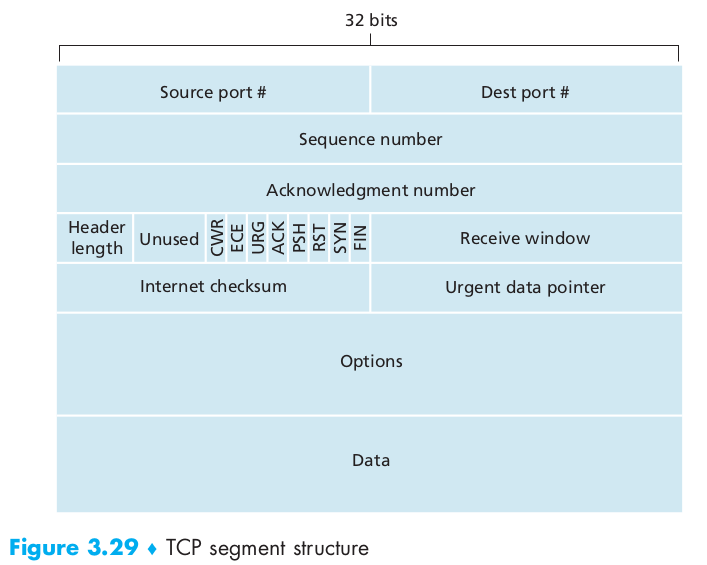

-   The TCP segment consists of header fields and a data field.

-   TCP header is typically 20 bytes (12 bytes more than UDP header
     length)

-   The data field contains a chunk of application data. Which is
     limited by MSS.

-   When TCP sends a large file, such as an image as part of a Web page,
     it typically breaks the file into chunks of size MSS (except for
     the last chunk, which will often be less than the MSS).

-   Interactive applications, often transmit data chunks that are
     smaller than the MSS.

-   What’s new in the TCP header and what is the same as UDP ?

-   The source and destination port numbers, and a checksum field is the
     same as UDP.

-   **New for RDT**: *The 32-bit sequence number field *

-   **New for RDT**: *The 32-bit acknowledgment number field*

-   **New for Flow Control**: *The 16-bit receive window field*
     (indicate the number of bytes that a receiver is willing to
     accept)

-   **New**: *The 4-bit header length field* (specifies the length of
     the TCP header in 32-bit words. The TCP header can be of variable
     length due to the TCP options field.

-   **New,Typically empty:** The *optional and variable-length options
     field* is used when a sender and receiver negotiate the maximum
     segment size (MSS) or as a window scaling factor for use in
     high-speed networks. A time-stamping option is also defined. See
     RFC 854 and RFC 1323 for additional details.

-   The ***flag field*** contains 8 bits.

1.  **ACK bit** indicate that the value carried in the acknowledgment
     field is valid; that is, the segment contains an acknowledgment
     for a segment that has been successfully received.

2.  **RST , SYN, and FIN bits** are used for connection setup and
     teardown.

3.  **CWR and ECE bits** are used in explicit congestion notification

4.  **PSH bit** indicates that the receiver should pass the data to the
     upper layer immediately. (Not Typically used)

5.  **URG bit** is used to indicate that there is data in this segment
     that the sending-side upper layer entity has marked as “urgent.”
     The location of the last byte of this urgent data is indicated by
     the 16-bit urgent data pointer field. TCP must inform the
     receiving-side upper-layer entity when urgent data exists and pass
     it a pointer to the end of the urgent data. (Not typically used)

***TCP Sequence Numbers:***

-   TCP views data as an unstructured, but ordered, stream of bytes.

-   The **sequence number** for a segment is therefore the byte-stream
     number of the first byte in the segment.

-   Both sides of a TCP connection randomly choose an initial sequence
     number. This is done to minimize the possibility that a segment
     that is still present in the network from an earlier,
     already-terminated connection between two hosts is mistaken for a
     valid segment in a later connection between these same two hosts
     (which also happen to be using the same port numbers as the old
     connection)

***TCP Acknowledgments:***

-   The **acknowledgment number** that Host A puts in its segment is the
     sequence number of the next byte Host A is expecting from Host B.
     Suppose Host A has received all bytes numbered 0 through 535 from
     B and suppose that it is about to send a segment to HostB. Host A
     is waiting for byte 536 and all the subsequent bytes in Host B’s
     data stream. So Host A puts 536 in the acknowledgment number field
     of the segment it sends to B.

-   **Because TCP only acknowledges bytes up to the first missing byte
     in the stream, TCP is said to provide cumulative
     acknowledgments.**

-   **What does a host do when it receives out-of-order segments in a
     TCP connection?** TCP RFCs do not impose any rules here and leave
     the decision up to the programmers implementing a TCP
     implementation. (Go Back N or Selective Repeat)

***Round-Trip Time Estimation and Timeout:***

-   TCP uses a timeout/retransmit mechanism to recover from lost
     segments. How to estimate this timeout ?

-   **SampleRTT**, for a segment: is the amount of time between when the
     segment is sent (that is, passed to IP) and when an acknowledgment
     for the segment is received.

-   Most TCP implementations take only one SampleRTT measurement at a
     time. That is, at any point in time, the SampleRTT is being
     estimated for only one of the transmitted but currently
     unacknowledged segments, leading to a new value of SampleRTT
     approximately once every RTT.

-   TCP also only measures SampleRTT for segments that have been
     transmitted once

-   Since the SampleRTT values will fluctuate from segment to segment
     due to congestion in the routers and to the varying load on the
     end systems, it is therefore natural to take some sort of average
     of the SampleRTT values.

-   TCP maintains an average, called **EstimatedRTT,** of the SampleRTT
     values.

**EstimatedRTT = (1- α)\*EstimatedRTT + α\*SampleRTT**

-   The new value of EstimatedRTT is a weighted combination of the
     previous value of EstimatedRTT and the new value for SampleRTT
     where influence of past sample decreases exponentially fast

-   *typical value: **α =** 0.125*

-   In statistics, such an average is called an *exponential weighted
     moving average (EWMA).*

-   In addition to having an estimate of the RTT, it is also valuable to
     have a measure of the variability of the RTT.

-   **DevRTT**: an estimate of how much SampleRTT typically deviates
     from EstimatedRTT:

**DevRTT = (1-β)\*DevRTT +β\*|SampleRTT-EstimatedRTT|**

-   DevRTT is an EWMA of the difference between SampleRTT and
     EstimatedRTT. If the SampleRTT values have little fluctuation,
     then DevRTT will be small; on the other hand, if there is a lot of
     fluctuation, DevRTT will be large.

-   *The recommended value of β is 0.25.*

-   The timeout interval should be greater than or equal to
     EstimatedRTT, or unnecessary retransmissions would be sent. But
     the timeout interval should not be too much larger than
     EstimatedRTT; otherwise, when a segment is lost, TCP would not
     quickly retransmit the segment, leading to large data transfer
     delays.Thus,

 **TimeoutInterval = EstimatedRTT + 4\*DevRTT**

-   *An initial TimeoutInterval value of 1 second is recommended*

-   Also, when a timeout occurs, the value of TimeoutInterval is doubled
     to avoid a premature timeout occurring for a subsequent segment
     that will soon be acknowledged. However, as soon as a segment is
     received and EstimatedRTT is updated, the TimeoutInterval is again
     computed using the formula above.

***3.5.4 Reliable Data Transfer:***

-   TCP creates a reliable data transfer service on top of IP’s
     unreliable best effort service.

-   TCP’s reliable data transfer service ensures that the data stream
     that a process reads out of its TCP receive buffer is
     ***uncorrupted, without gaps, without duplication, and in
     sequence***; that is, the byte stream is exactly the same byte
     stream that was sent by the end system on the other side of the
     connection.

-   Recommended TCP timer management procedures use only a ***single
     retransmission timer***, even if there are multiple transmitted
     but not yet acknowledged segments. It is helpful to think of the
     timer as being associated with the oldest unacknowledged segment.

-   The TCP state variable ***SendBase*** is the sequence number of the
     oldest unacknowledged byte.

-   Consider first a ***simplified TCP Sender*** that ignores duplicate
     acks, flow control and congestion control. ***Three events occur:
     Data Receipt, ACK Receipt and Timeout***

 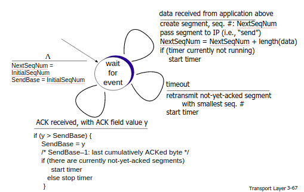

***TCP Retransmission Scenarios:***

-   Host A sends a segment to Host
     B.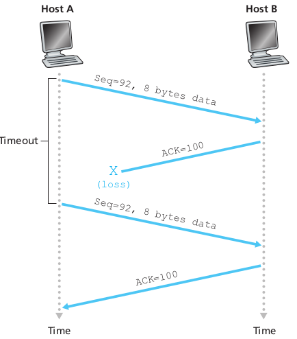

-   Suppose that this segment has sequence number 92 and contains 8
     bytes of data. Host A waits for a segment from B with
     acknowledgment number 100.

-   Although the segment from A is received at B, the acknowledgment
     from B

to A gets lost.

-   In this case, the timeout event occurs, and Host A retransmits the
     same

segment.

-   Host B receives the retransmission, TCP in Host B will discard the
     bytes in the retransmitted segment due to observing the
     retransmission by seq.no.

-   Host A sends two segments back to
     back.

-   Suppose that both segments arrive intact at B, and B sends two
     separate acknowledgments for each of these segments.

-   Suppose now that neither of the acknowledgments arrives at Host A
     before the timeout.

-   When the timeout event occurs, Host A resends the first segment with
     sequence number 92 and restarts the timer.

-   As long as the ACK for the second segment arrives before the new
     timeout, the second segment will not be
     retransmitted.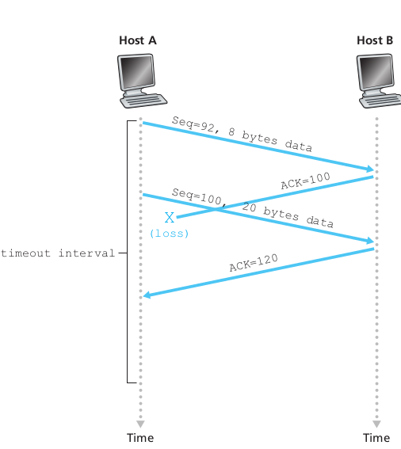

-   Host A sends the two segments

-   The acknowledgment of the first segment is lost in the

-   network, but just before the timeout event

-   Host A receives an acknowledgment with acknowledgment number 120.
     Host A therefore knows that Host B has received everything up
     through byte 119

-   Host A does not resend either of the two segments

***Doubling the Timeout Interval:***

-   Whenever the timeout event occurs, TCP retransmits the
     not-yet-acknowledged segment with the smallest sequence number, as
     described above. But each time TCP retransmits, it sets the next
     timeout interval to twice the previous value.

-   However, whenever the timer is started after either of the two other
     events (that is, data received from application above, and ACK
     received), the TimeoutInterval is derived from the most recent
     values of EstimatedRTT and DevRTT.

-   This modification provides a limited form of congestion control.
     **Why ?**

 *Congestion is caused by too many packets arriving at one (or more)
 router queues in the path between the source and destination, causing
 packets to be dropped and/or long queuing delays. In times of
 congestion, if the sources continue to retransmit packets
 persistently, the congestion may get worse. Instead, TCP acts more
 politely, with each sender retransmitting after longer and longer
 intervals.*

***Fast Retransmit:***

-   One of the problems with timeout-triggered retransmissions is that
     the timeout period can be relatively long.

-   When a segment is lost, this long timeout period forces the sender
     to delay re-sending the lost packet, thereby increasing the
     end-to-end delay.

-   The Sender thus makes use of **Duplicate ACKs**, *A duplicate ACK is
     an ACK that re-acknowledges a segment for which the sender has
     already received an earlier acknowledgment.*

-   If the TCP sender receives three duplicate ACKs for the same data,
     it takes this as an indication that the segment following the
     segment that has been ACK’ed three times has been
     lost.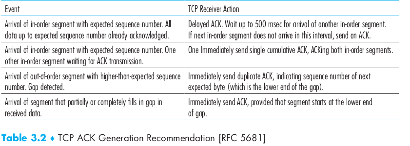

-   In the case that three duplicate ACKs are received, the TCP sender
     performs a fast retransmit, transmitting the missing segment
     before that segment’s timer expires.

-   To allow for this modification to take place in the Simple Sender we
     shown earlier, the following else statement is added to the ACK
     received event:

 else {/\* a duplicate ACK for already ACKed

 segment \*/

 increment number of duplicate ACKs

 received for y

 if (number of duplicate ACKS received

 for y==3)

 /\* TCP fast retransmit \*/

 resend segment with sequence number y

 }

 Break;

***3.5.5 Flow Control:***

-   Hosts on each side of a TCP connection set aside a receive buffer
     for the connection. When the TCP connection receives bytes that
     are correct and in sequence, it places the data in the receive
     buffer.

-   The associated application process will read data from this buffer,
     but not necessarily at the instant the data arrives. If the
     application is relatively slow at reading the data, the sender can
     very easily overflow the connection’s receive buffer by sending
     too much data too quickly.

-   TCP provides a **flow-control service** to its applications to
     eliminate the possibility of the sender overflowing the receiver’s
     buffer. It is matching the rate at which the sender is sending
     against the rate at which the receiving application is reading.

-   TCP provides flow control by having the sender maintain a variable
     called the **receive window**. Informally, the receive window is
     used to give the sender an idea of *how much free buffer space is
     available at the receiver. *

-   Because **TCP is full-duplex**, the sender at each side of the
     connection maintains a distinct receive window.

-   Variables are defined in Receiver:

 **LastByteRead**: the number of the last byte in the data stream read
 from the buffer by the application process in receiver.

 **LastByteRcvd:** the number of the last byte in the data stream that
 has arrived from the network and has been placed in the receive buffer
 at receiver.

-   **Condition of not overflowing :** *LastByteRcvd – LastByteRead
     &lt;= RcvBuffer*

-   **Receive Window “rwnd”:** is the amount of spare room in the
     buffer:

 *rwnd = RcvBuffer – \[LastByteRcvd – LastByteRead\]*

-   ***How does the connection use the variable rwnd to provide the
     flow-control service?***

 If Host A is sending to Host B, Host B tells Host A how much spare
 room it has in the connection buffer by placing its current value of
 rwnd in the receive window field of every segment it sends to A.
 Initially, Host B sets rwnd = RcvBuffer.

 Host A in turn keeps track of two variables, LastByteSent and
 LastByteAcked

 Note that the difference between these two variables, LastByteSent –
 LastByteAcked, is the amount of unacknowledged data that A has sent
 into the connection. By keeping the amount of unacknowledged data less
 than the value of rwnd, Host A is assured that it is not overflowing
 the receive buffer at Host B.

-   The TCP specification requires Host A to continue to send segments
     with one data byte when B’s receive window is zero. These segments
     will be acknowledged by the receiver. Eventually the buffer will
     begin to empty and the acknowledgments will contain a nonzero rwnd
     value.

***3.5.6 TCP Connection Management:***

-   ***How a TCP connection is established ?***

1.  The client application process first informs the client TCP that it
     wants to establish a connection to a process in the server.

2.  The client-side TCP first sends a special TCP segment to the
     server-side TCP namely a **SYN Segment** which is called this way
     because a flag SYN is set and it contains no application layer
     data. In addition, the client randomly chooses an initial sequence
     number (client\_isn) and puts this number in the sequence number
     field of the initial TCP SYN segment.

3.  Once the IP datagram containing the TCP SYN segment arrives at the
     server host (assuming it does arrive!), the server extracts the
     TCP SYN segment from the datagram, allocates the TCP buffers and
     variables to the connection, and sends a connection-granted
     segment \[**SYNACK segment**\] to the client TCP.

 This connection-granted segment also contains no application-layer
 data. However, it does contain three important pieces of information
 in the segment header. First, the SYN bit is set to 1. Second, the
 acknowledgment field of the TCP segment header is set to
 client\_isn+1. Finally, the server chooses its own initial sequence
 number (server\_isn) and puts this value in the sequence number field
 of the TCP segment header.

 Note that the allocation of these buffers and variables before
 completing the third step of the three-way handshake makes TCP
 vulnerable to a denial-of-service attack known as SYN flooding.

1.  Upon receiving the SYNACK segment, the client also allocates buffers
     and variables to the connection. The client host then sends the
     server yet another segment; this last segment acknowledges the
     server’s connection-granted segment (the client does so by putting
     the value server\_isn+1 in the acknowledgment field of the TCP
     segment header).

 The SYN bit is set to zero, since the connection is established. This
 third stage of the three-way handshake may carry client-to-server data
 in the segment payload.

1.  Note that in order to establish the connection, three packets are
     sent between the two hosts, this is way it is referred to as a
     **three-way
     handshake**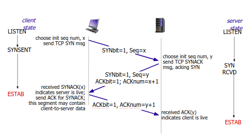

-   ***TCP 3-hand way shake
     FSM:***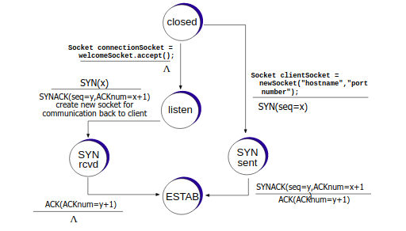

-   ***Ending a TCP connection:***

-   Either of the two processes in a TCP connection can end the
     connection.

-   When a connection ends, the “resources” in the hosts are
     deallocated.

-   The client application process issues a close command. This causes
     the client TCP to send a special TCP segment to the server
     process. This special segment has a flag bit in the segment’s
     header, the FIN bit set to 1.

-   When the server receives this segment, it sends the client an
     acknowledgment segment in return. The server then sends its own
     shutdown segment.which has the FIN bit set to 1.

-   Finally, the client acknowledges the server’s shutdown segment. At
     this point, all the resources in the two hosts are now
     deallocated.

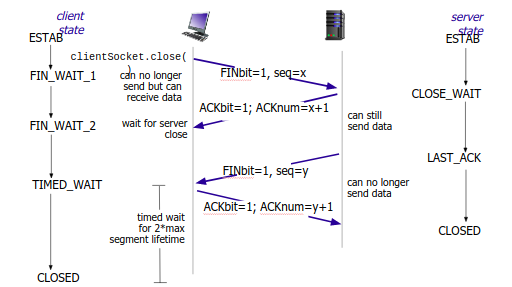

***3.6 Principles of Congestion Control:***

-   Network congestion is too many sources attempting to send data at
     too high a rate.

-   Examining three increasingly complex scenarios in which congestion
     occurs.

***Scenario 1:***

-   Two Senders (A,B) and Two Receivers (C,D).

-   Sending rate: $\lambda_{\text{in}}$ bytes/sec, Receiving rate:
     $\lambda_{\text{out}}$ bytes/sec

-   Packets from Hosts A and B pass through a router and over a shared
     outgoing link of capacity R. The router has buffers that allow it
     to store incoming packets when the packet-arrival rate exceeds the
     outgoing link’s capacity. In this first scenario, we assume that
     the router has an infinite amount of buffer
     space.

For a sending rate **between 0 and R/2**, the throughput at the receiver
equals the sender’s sending rate.

When the sending rate is **above R/2,** however, the throughput is only
R/2. This upper limit on throughput is a consequence of the sharing of
link capacity between two connections.

The right-hand graph in Figure 3.44, however, shows the **consequence of
operating near link capacity.** As the sending rate approaches R/2 (from
the left), the **average delay becomes larger and larger.**

***Scenario 2: Same Figure as Scenario 1 with these modifications
below***

-   The amount of router buffering is now assumed to be finite.

-   We assume that each connection is reliable. If a packet containing a
     transport-level segment is dropped at the router, the sender will
     eventually retransmit it.

-   The rate at which the transport layer sends segments:

     ${\lambda'}_{\text{in}}$bytes/sec ( offered load )

 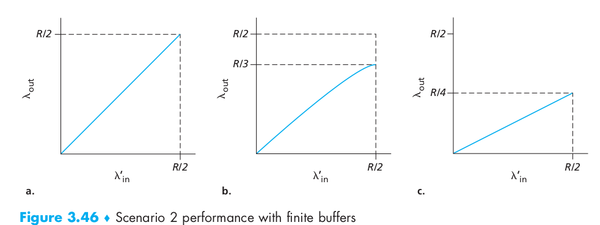

(a) Unrealistic case that Host A is able to somehow (magically!)
     determine whether or not a buffer is free in the router and thus
     sends a packet only when a buffer is free. In this case, no loss
     would occur. Throughout is ideal.

(b) More realistic case that the sender retransmits only when a packet
     is known for certain to be lost.Thus,At (${\lambda'}_{\text{in}}$=
     R/2 ), out of the 0.5R units of data transmitted, 0.333R bytes/sec
     (on average) are original data and 0.166R bytes/sec (on average)
     are retransmitted data.

(c) The case that the sender may time out prematurely and retransmit a
     packet that has been delayed in the queue but not yet lost. Both
     the original data packet and the retransmission may reach the
     receiver. In this case, the work done by the router in forwarding
     the retransmitted copy of the original packet was wasted. Since
     each packet is assumed to be forwarded twice, the throughput will
     have an asymptotic value of R/4 as the offered load approaches
     R/2.

***Scenario 3: Four Senders, Routers with Finite Buffers, and Multihop
Paths:***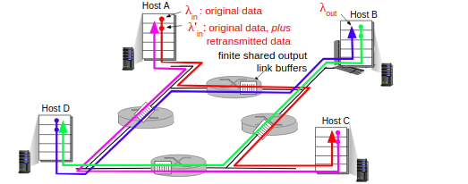

 R2

-   For extremely small values of $\lambda_{\text{in}}$ , buffer
     overflows are rare and the throughput approximately equals the
     offered load. Thus, for small values of $\lambda_{\text{in}}$ , an
     increase in $\lambda_{\text{in}}$results in an increase in
     $\lambda_{\text{out}}$ .

-   Let’s next examine the case that $\lambda_{\text{in}}$ (and hence
     ${\lambda'}_{\text{in}}$) is extremely large.

-   Consider R2, sharing connection C-A and B-D, the arrival rate of B–D
     traffic at R2 can be much smaller than that of the C-A traffic.
     (Bec. C is closer to R2)

-   The C-A and B–D traffic must compete at router R2 for the limited
     amount of buffer space, the amount of B-D traffic that
     successfully gets through R2 becomes smaller and smaller as the
     offered load from C-A gets larger and
     larger.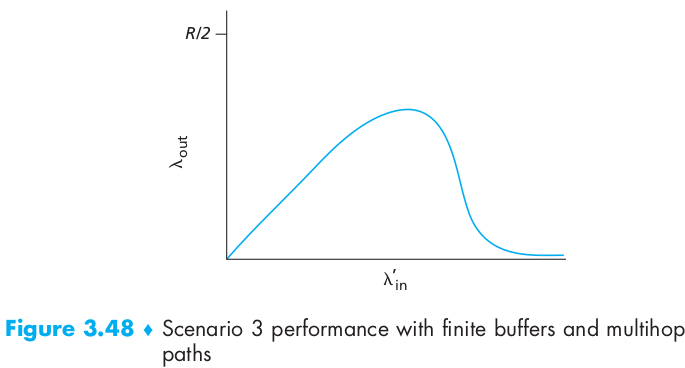

 The reason for the eventual decrease in throughput with increasing
 offered load is evident when one considers the amount of wasted work
 done by the network. In the high-traffic scenario outlined above,
 whenever a packet is dropped at a second-hop router, the work done by
 the first-hop router in forwarding a packet to the second-hop router
 ends up being “wasted.”

***Costs of Congestion: ***

1.  Large queuing delays are experienced as the packet-arrival rate
     nears the link capacity.

2.  Unneeded retransmissions by the sender in the face of large delays
     may cause a router to use its link bandwidth to forward unneeded
     copies of a packet.

3.  When a packet is dropped along a path, the transmission capacity
     that was used at each of the upstream links to forward that packet
     to the point at which it is dropped ends up having been wasted.

***3.7 TCP Congestion Control***

-   TCP must use end-to-end congestion control rather than
     network-assisted congestion control, since the IP layer provides
     no explicit feedback to the end systems regarding network
     congestion.

-   The approach taken by TCP is to have each sender limit the rate at
     which it sends traffic into its connection as a function of
     perceived network congestion.

 Little Congestion: TCP sender increases its send rate

 More Congestion: TCP sender reduces its send rate.

-   ***Question 1: How the Sender limits it’s rate ?***

-   It keeps track of an additional variable, the congestion window
     (cwnd).

-   And impose a constraint, the amount of unacknowledged data at a
     sender may not exceed the minimum of cwnd and rwnd:

 LastByteSent – LastByteAcked &lt;= min{cwnd, rwnd}

-   Assume that the TCP receive buffer is so large that the
     receive-window constraint can be ignored and the amount of
     unacknowledged data is determined solely by (cwnd).

-   Thus the sender’s send rate is roughly cwnd/RTT bytes/sec. By
     adjusting the value of cwnd, the sender can therefore adjust the
     rate at which it sends data into its connection

-   ***Question 2: How the Sender perceives congestion?***

-   When there is excessive congestion, then one (or more) router
     buffers along the path overflows, causing a datagram (containing a
     TCP segment) to be dropped. The dropped datagram, in turn, results
     in a loss event at the sender—either a timeout or the receipt of
     three duplicate ACKs—which is taken by the sender to be an
     indication of congestion on the sender-to-receiver path.

-   Note that if acknowledgments arrive at a relatively slow rate (e.g.,
     if the end-end path has high delay or contains a low-bandwidth
     link), then the congestion window will be increased at a
     relatively slow rate. On the other hand, if acknowledgments arrive
     at a high rate, then the congestion window will be increased more
     quickly.

-   Because TCP uses acknowledgments to trigger (or clock) its increase
     in congestion window size, TCP is said to be **self-clocking.**

-   ***Question 3: How do the TCP senders determine their sending rates
     such that they don’t congest the network but at the same time make
     use of all the available bandwidth?***

-   The answer is by ***Bandwidth probing*** , given ACKs indicating a
     congestion-free source-to-destination path and loss events
     indicating a congested path, TCP’s strategy for adjusting its
     transmission rate is to increase its rate in response to arriving
     ACKs until a loss event occurs, at which point, the transmission
     rate is decreased.

-   The TCP sender thus increases its transmission rate to probe for the
     rate that at which congestion onset begins, backs off from that
     rate, and then to begins probing again to see if the congestion
     onset rate has changed.

***TCP congestion-control algorithm: ***

The algorithm has three major components: (1) slow start, (2) congestion
avoidance, and (3) fast recovery. TCP congestion control is often
referred to as an **additive-increase, multiplicative- decrease (AIMD)**
form of congestion control.

***Slow Start:***

-   When a TCP connection begins, the value of cwnd is typically
     initialized to a small value of 1 MSS, resulting in an initial
     sending rate of roughly MSS/RTT.

-   For example, if MSS = 500 bytes and RTT = 200 msec, the resulting
     initial sending rate is only about 20 kbps.

-   In the slow-start state, the value of cwnd begins at 1 MSS and
     increases by 1 MSS every time a transmitted segment is first
     acknowledged.

-   This process results in a doubling of the sending rate every RTT.
     Thus, the TCP send rate starts slow but grows exponentially during
     the slow start phase.

-   ***Question: When should this exponential growth end? There are 3
     ways***

1.  If there is congestion indicated by a timeout, the TCP sender sets
     the value of cwnd to 1 and begins the slow start process anew. It
     also sets the value of a second state variable, ssthresh “slow
     start threshold” to cwnd/2—half of the value of the congestion
     window value when congestion was detected.

2.  Since ssthresh is half the value of cwnd when congestion was last
     detected, it might be a bit reckless to keep doubling cwnd when it
     reaches or surpasses the value of ssthresh. Thus, when the value
     of cwnd equals ssthresh, slow start ends and TCP transitions into
     congestion avoidance mode.

3.  If three duplicate ACKs are detected, in which case TCP performs a
     fast retransmit and enters the fast recovery state

***Congestion Avoidance:***

-   Rather than doubling the value of cwnd every RTT, TCP adopts a more
     conservative approach and increases the value of cwnd by just a
     single MSS every RTT

-   For example, if MSS is 1,460 bytes and cwnd is 14,600 bytes, then 10
     segments are being sent within an RTT. Each arriving ACK (assuming
     one ACK per segment) increases the congestion window size by 1/10
     MSS, and thus, the value of the congestion window will have
     increased by one MSS after ACKs when all 10 segments have been
     received.

-   ***Question: When should congestion avoidance linear increase
     end?***

-   TCP’s congestion-avoidance algorithm behaves the same when a timeout
     occurs.

-   When a loss event triggered by a triple duplicate ACK event occurs,
     TCP halves the value of cwnd (adding in 3 MSS for good measure to
     account for the triple duplicate ACKs received) and records the
     value of ssthresh to be half the value of cwnd when the triple
     duplicate ACKs were received. The fast-recovery state is then
     entered.

***Fast Recovery:***

-   The value of cwnd is increased by 1 MSS for every duplicate ACK
     received for the missing segment that caused TCP to enter the
     fast-recovery state.

-   Eventually, when an ACK arrives for the missing segment, TCP enters
     the congestion-avoidance state after deflating cwnd.

-   If a timeout event occurs, fast recovery transitions to the
     slow-start state after performing the actions: The value of cwnd
     is set to 1 MSS, and the value of ssthresh is set to half the
     value of cwnd when the loss event occurred.

-   Fast recovery is a recommended, but not required, component of TCP.

***TCP Congestion Control FSM:***

***Example of TCP Congestion Control:***

An early version of TCP, known as **TCP Tahoe**, unconditionally cut its
congestion window to 1 MSS and entered the slow-start phase after either
a timeout-indicated or triple duplicate ACK indicated loss event. The
newer version of TCP, **TCP Reno**, incorporated fast
recovery

-   The threshold is initially equal to 8 MSS.

-   For the first eight transmission rounds, Tahoe and Reno take
     identical actions.

-   The congestion window climbs exponentially fast during slow start
     and hits the threshold at the fourth round of transmission.

-   The congestion window then climbs linearly until a triple duplicate-
     ACK event occurs, just after transmission round 8. (cwnd was equal
     12 \* MSS)

-   The value of ssthresh is then set to 0.5 \*cwnd = 6 \* MSS.

-   Under TCP Reno, the congestion window is set to cwnd = 9 \* MSS and
     then grows linearly.

-   Under TCP Tahoe, the congestion window is set to 1 MSS and grows
     exponentially until it reaches the value of ssthresh, at which
     point it grows linearly.

