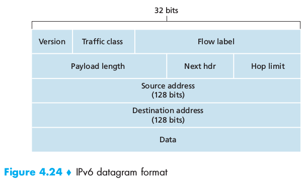

# Chapter 4: The Network Layer
In the chapter, there is an important distinction between the **routing** and **forwarding** functions of the network layer. Forwarding involves the transfer of a packet from an incoming link to an outgoing link *within a single router* while routing involves *all of a network's routers* whose collective interactions via routing protocols determine the paths that packets take on their trips from source to destination.

## 4.1 Introduction
The primary role of routers is to forward datagrams from input links to output links. Routers do not run nor the application-layer or the transport-layer, they go only up until the network layer.

### 4.1.1 Forwarding and Routing
The role of the network layer is deceptively simple: **to move packets from a sending hosts to a receiving host**. To do so it performs two important functions:

 - ***Forwarding***: When a packet arrives to a router's input link, the router must move the packet to the appropriate output link. It is an action **local** to the router
 - ***Routing***: The network layer must determine the route or path taken by packets as they flow from a sender to a receiver. The algorithms that calculate these paths are referred to as **routing algorithsm**. It is a **network-wide** action

Every router has a **forwarding table**. When a router receives a packet, it extracts a value from a specific field in the header and searches for that value in in the forwarding table.
The procedure used to set up and update the table depends on the protocol used. However a router receives and sends *routing protocol messages* to configure its forwarding table.

We also need to mark the distinction between routers and *packet switches*.

 - Packet-switches: performs forwarding according to the value in a field in the header of the packet. Some packet switches called **link-layer switches** base their forwarding decisions on values in the fields of the *link-layer frame* (link-layer devices)
 - Routers: base forwarding decisions on the value in the network-layer field. (network-layer devices) but also must implement link layer (no 3 without 2)

#### Connection Setup
in some computer networks there is a third really important networks-layer function: **connection setup**: a **path-wide** process that sets up connection state in routers.

### 4.1.2 Network Service Models
The **network service model** defines the characteristics of end-to-end transport of packets between sending and receiving end systems. Some possible service for a network layer:

 1. Sending side:
	 - *Guaranteed delivery*
	 - *Guaranteed delivery with bounded delay*
 2. Flow and receiving side:
	- *In-order packet delivery*
	- *Guaranteed minimal bandwidth*
	- *Guaranteed maximum jitter* (amount of time between transmission of two successive packets at the sender side is equal to the amount of time between their receipt at the destination, or that this spacing changes by no more than some specified value)
	- *Security services*: encryption for confidentiality, data integrity and source authentication

**The Internet's network layer doesn't provide any of these**: it provides a **best-effort service** there are no timing or bandwidth guarantees, no loss or order guarantees and congestion control indications.

## 4.2 Virtual  Circuit and Datagrams Networks
As in transport layer, the network layer can use connection or connection-less protocols. There however some differences with the transport layer:

 - In the network layer these services are **host-to-host** services (not the case for the TL, just look at TCP)
 - The network layer provides either a host-to-host connectionless service or a host-to-host connection service **but no both**. Connection service -> **Virtual-Circuit (VC) networks**, Connectionless service -> **datagram networks**

### 4.2.1 Virtual-Circuit Networks
The Internet is a datagram network but many alternative network architectures (ATM) are virtual-circuit networks. The connections in VC are called **virtual circuits (VCs)3*.
A VC consists of

 1. A source-to-destination *path*
 2. VC numbers, one for each link along the path
 3. Entries in the forwarding table in each router along the path

A packet belonging to a virtual circuit will carry a VC number in its header. Because a VC may have different VC numbers on each link, each router must replace the VC number of traversing packets with a new VC number, which is obtained from the forwarding table. How is this determined?
Whenever a VC is established across a router, an entry is added to the forwarding table, and one (corresponding to the terminating VC) is removed whenever a VC ends.
The routers must maintain **connection state information** for the ongoing connections (using the tablea). There are 3 phases in a VC:

 - *VC Setup*: sending side contacts networks layer specifying the IP address of the destination. The network sets up the VC. The path is determined as well as the VC number for each link along the path. The forwarding tables are updated and resources reserved.
 - *Data transfer*: the packets flow
 - *VC teardown*: The call termination propagates along the path, the forwarding tables are updated

During network-layer setup *all the routers along the path between source and destination are involved in VC setup, and each router is fully aware of all VCs passing through it* (not in TCP: setup and connection only between source and destination).
The messages used by end ssystems to initiate or terminate a VC are called **signaling messages** and the protocols used to exchange them are called **signaling protocols**.

### 4.2.2 Datagram Networks
Each time an end system wants to send a packet, it sampts the packet with the address of the destination end system and pops the packet into the network. The routers along the path will use this address to forward it.
The router has a forward table that *maps destination addresses to link interfaces*. When a packet arrives, it reads the destination address, uses the table to determine what link to use, and forwards the packet to that output link interface.

If we consider IPv4, addresses are 32 bits long. To avoid having tables with 2^32 entries, routers use **prefixes**. When there are multiple mathces to one address, the router uses the **longest prefix matching rule**.

Although routers in datagram networks maintain no connection state information, they nevertheless maintain forwarding state information in their forwarding tables.

### 4.2.3 Origins of VC and Datagram Networks
VC has its roots in the telephony world, which uses circuits switching too.
The datagram model instead comes from the need to simplify as much as possible the network to bring computers together.

## 4.3 What's Inside a Router?

 - *Input ports*: performs the physical layer functions of incoming link at the router. It is also here that the forwarding table is consulted to determine the output port to which the arriving packet will be forwarded via the switching fabric. Control packets (protocol info) are forwarded to the routing processor.
 - *Switching fabric*: connects input prots to output ports.
 - *Output ports*: stores packets received from the switching fabric and performs the necessary link layer and physical layer functions.
 - *Routing processor*: executes the routing protocols (algorithms), maintains routing tables and attached link state information and computes the forwarding table for the router.

Input ports, switching fabric and output ports implement the forwarding function and are almost always implemented in hardware (*routing forwarding plane hardware*) while the routing processor implements the routing function and is usually implemented in software running on traditional CPU (*router control plane*)

### 4.3.1 Input Processing
The packet arrives and the link and phyisical layer unpacking functions are performed. The forwarding table is computed and updated by the routing processor with a shadow copy typically stored at each input port so that forwarding decision can be made locallly without invoking the centralized routing processor on a per packet basis and thus avoiding a centralized processing bottleneck. The table is transferred to ports through separated bus. The lookup is then just a search (implemented in hardware and using high performance algorithms), speed also depends on the memory technology (DRAM, SRAM...). Lookup is important but input processing also consists of

 - physical and link layer processing
 - chekcing the packet's version number, checksum, time to live....
 - updating counters for network management.

Input ports than moves the packet to the switching fabric (eventually queuing them if this is busy)

### 4.3.2 Switching
Can be performed in different ways:

#### Switching via memory
Switching under the control of the CPU and input and output ports functioned as traditional I/O devices in a traditional operating system. The packet arrives, is copied into the processor memory, the processor determines the output port and copies the packet to the output port's buffer.
No parallel forwarding (only 1 memory read/write bus)

#### Switching via a bus
An input port transfers a packet directly to the output port over a shared bus without intervention by the routing processor. The input port pre-pends an internal header to the packet. All the output ports receive the packet but only the one that matches the label in the internal header will keep the packet. The output port will remove this internal header. The switching speed is limited to the bus speed as one packet at a time can cross the bus (multiple arriving packets will have to wait). Sufficient only for small area and enterprise networks

#### Switching via an interconnected network
To overcome the bandwidth limitation of a single shared bus a more sophisticated interconnection network can be used.
A *crossbar switch* is an interconnection network consisting of 2N buses that connect N input ports to N output ports. Each vertical bus intersects each horizontal bus at a crosspoint which can be opened or closed at any time by the switch fabric controller. If a packet has to go from input X to output Y, only the crosspoint between the horizontal bus from X and the vertical bus to Y will be closed.
Thus packets directed to different output ports can be forwarded simultaneously, but not multiple packets directed to the same output port.

### 4.3.3 Output Processing
takes packets stored in the output's port's memory and transmits them over the output link, thus selecting de dequeuing packets for transmission and performing the necessary link and physical layer transmission functions.

### 4.3.4 Where Does Queuing Occur?
Queues may form at both the input ports and the output ports. The location and the extent of queuing will depend on traffic load, speed of the switching fabric, and line speed. As the queues grow large, the router's memory can eventually be exhausted and **packet loss** will occur. IS THIS USEFUL ? NOT COVERED BY TEACHER

## 4.4 The Internet Protocol (IP): Forwarding and Addressing in the Internet
We know move to study of the network layer in the Internet. There are two versions of the IP (Internet Protocol) in use today: IPv4 and IPv6.
There 3 main components in the Internet: the IP Protocol (addressing, datagram format and packet handling conventions), the routing protocol (path selection), the Internet Control Message Protocol (ICMP) (error reporting and network information).

### 4.4.1 Datagram Format
A network layer packet is referred to as a **datagram**.

Some fields:

 - *Version number*: 4 bits specifying the IP protocol version of the datagram (IPv4 or IPv6 )
 - *Header length*: the length of the packet is variable therefore this field tells where the header ends and the data begins. Usually datagrams contain no option so that the typical IP datagram has **20-byte header**
 - *Type of service* (TOS): allows different types of datagrams to be distinguished from each other. (eg real time vs non real time)
 - *Datagram length*: 16 bits specifying the total length, that is header + data measured in bytes. 16 bits -> max header length = 65535 bytes, but usually datagrams are rarely larger than 1500 bytes.
 - *Identifier, flags, fragmentation offset*: used for IP fragmentation. (NB: IPv6 doesn't allow fragmentation at routers)
 - *Time-to-live* (TTL): used to avoid that datagrams circulate forever. It is decreased by one each time the datagram is processed by a router. When TTL = 0, the datagram is dropped
 - *Protocol*: only used when datagram reaches its final destination, it specifies what *transport protocol* to which the data of the datagram should be passed. EX: 6 -> TCP, 17 -> UDP
 - *Header checksum*: helps the router to detect bit errors in a received IP datagram. Computation: each two bytes in the **header** are considered as numbers, summed up using the 1s complement arithmetic. The 1s complement of this sum is then put in the checksum field. A router computes the checksum for each datagram. If the computed one doesn't equal the one in the field then the router has detected an error. Usually the datagram is discarded. As it is recomputed at each router, it may change.
 - *Source and destination IP addresses*
 - *Options*: rarely used, dropped by IPv6
 - *Data (payload)*: usually contains the transport layer segment but can also contain ICMP messages

#### IP Datagram Fragmentation
The maximum amount of data that a link layer can carry is called the **Maximum Transmission Unit (MTU)**. As each datagram is encapsulated in a link layer frame, the MTU imposes a hard limit on the length of the datagram. Each of the links along the route can use different link-layer protocols and therefore can have different MTU.
We therefore have to break the IP datagram into smaller datagrams, each of which will go in different link layer frames. Each of these smaller datagrams is referred to as a **fragment**.
A fragment must be reassembled before it can be passed to the transport layer. To reduce the workload on routers, the designers of IPv4 decided that reassembling should only be done at the destination end system.

In IPv4, to comply with fragmentation, the header contains the fields:
 - *Identifiers*: identifies the **unfragmented datagram** (same for all fragments)
 - *flags*: in particular there is one flag set to 0 if the fragment is the last or to 1 if there are more to come
 - *fragmentation offset*: an integer x, the data in the fragment should be inserted beginning at byte x * 8

If one fragment contains error or is lost, all the others are dropped and TCP will have the sender retransmit all the data.
Fragmentation complicates the network and end systems and can be used in lethal DoS attacks such as the Jolt2 attack

### 4.4.2 IPv4 Addressing
The boundary between the host and the physical link is called an **interface**. A router has multiple links connected to it, therefore multiple interfaces and therefore a router has multiple IP addresses and *an IP address is technically associated with an interface rather than with a host or router*.
IPv4 addresses are 32 bits long (4 bytes) -> max 2^32 possible addresses. They are typically writen in **dotted decimal notation** where each byte of the address is written in deciaml from and separated by a period from the others.
EX 193.32.216.9 === 11000001 00100000 11011000 00001001
Each interface on every host (except host behind NATs) must have a unique IP address. How are these computed?
A portion is determined by the subnet to which the host is connected.
A subnet is the portion of the network interconnected end systems and one one router. (also called *IP network* or *network*). IP assigns an address to a subnet x.x.x.x/y where /y notation, sometimes known as a **subnet mask** indicates *that the leftmost y bits of the 32 bit quantity define the subnet address*. If y is 24, then any host attached to the a.a.a.0/24 subnet would be *required* to have an address of the form a.a.a.xxx.

FIGURE 4.17 WTF

The Internet's address assignment strategy is known as **Classless Interdomain Routing (CIDR)**. It generalizes the notion of subnet addressing. Consider a.b.c.d/x : the x most significant bits constitute the network portion of the IP address and are often referred to as the **prefix** (or *network prefix*). EX an organization is assigned a block of contiguous addresses, that is, a range of addresses with a common prefix.
When someone outside the organization want to send a datagram to someone inside, he will only need this x bits. The remaining 32-x bits can be thought of as distinguishing among the devices within the organization. These bits may have an additional subnetting structure.
There is yet another type of IP address, the *IP broadcast address 255.255.255.255*. When a datagram is sent to this address, the datagram is delivered to all hosts on the same subnet.

#### Obtaining a Block of Addresses
A network administrator contacts an ISP which would provide a partition of the addresses that had already been allocated to him.
EX ISP has 200.23.16.0/20, it splits in 8 equal sized blocks: 200.23.16.0/23, 200.23.18.0/23, 200.23.20.0/23, ..., 200.23.30.0/23
Who assigns set of addresses to ISPs? The ***Internet Corporation for Assigned Names and Numbers (ICANN)*** which allocates IP addresses, manages DNS root servers, assigns domain names and solves domain name disputes.

#### Obtaining a Host Address: The Dynamic Host Configuration Protocol
Once an organization has obtained a block of addresses, it can assign individual IP addresses to the hosts and router interfaces which are part of it. This can be done either **manually** (by the network administrator) or automatically by the **Dynamic Host Configuration Protocol (DHCP)**.
It can be configured so that a host receives the same IP each time it connects to the network or a temporary IP addresses that will change upon each connection. DHCP also transmits to hosts additional information (subnet mask, address of first-hop = default gateway, address of local DNS server).
As it automates the connection of a host into the network, DHCP is often referred to as a **plug-and-play protocol**. It is also popular in *wireless LANs where hosts join and leave frequently and in *residential ISP access networks*.
DHCP is a *client-server protocol*, the client being a newly arriving host needing network configuration information and the server being a router or a *DHCP relay agent* that know the address of a DHCP server for that network.
For a new client there is a 4 step process i nthe DHCP protcol:

 1. *DHCP server discovery* c (client) looks for a server sending **DHCP discover message** a UDP packet directed to port 67. This segment is encapsulated in datagram sent to 255.255.255.255 (broadcast address) from address 0.0.0.0
 2. *DHCP server offer(s)* s (server) replies with a **DHCP offer message** broadcast to all nodes on the subnet using (sent to 255.255.255.0). c may receiver many of these (more servers) containing the transaction ID, proposed IP address and an address lease time (amout of time for which the address will be valid)
 3. *DHCP request*: c chooses one offer and responds to s with a **DHCP request message** echoing back the configuration parameters
 4. *DHCP ACK* s responds with **DHCP ACK message** confirming

DHCP also provides a mechanism for renewing the lease on an address.

#### Network Address Translation (NAT)
Every IP-capable device needs an IP address. The number of connected devices grows fast, how to deal with IPv4 address space exhaustion?
**Network Address Translation (NAT)**
The NAT-enabled router defines a **realm** (or private network) (a network whose addresses only have meaning to devices within that network) and it can use the whole 32 bit address space for devices connected to it, it will also have a public address used to communicate with the exterior. The picture is explicative.

From the outside the router looks like a single device with a single IP address. It hides the details of the internal network from the outside world. Internal addresses can be assigned using DHCP.

Problems with NAT:

 - Port number should be used for addressingi processes not hosts
 - Routers shouldn't have access to the transport layer (ports)
 - NAT violates end-to-end argument (any host should be able to contact any other host)
 - NAT interferes with P2P applications (peers hidden by NAT), therefore the need of **connection reversal** for **NAT traversal**

#### UPnP
NAT traversal is increasingly provided by Universal Plug and Play. It requires both the host and the NAT to be compatible. Host requests a NAT mapping_
*(private IP address, private port number) -> (public IP address, public port number)*
If the NAT accepts and creates the mapping, then outsiders can create connections to (public IP address, public port number).

### 4.4.3 Internet Control Message Protocol
ICMP is used to communicate network-layer information between hosts and routers, usually for error reporting (ex Destination network unreachable).
ICMP is considered part of IP but architecturally lies just above IP as ICMP messages are carried inside IP datagrams as payloads.
ICMP have a type and a code field and carry the header and the first 8 bytes of the datagram that caused the message to be generated in the first place.
Ping and traceroute are implemented using ICMP messages

#### Inspecting datagrams: firewalls and intrusion detection systems
Firewalls inspect the datagram and segment header fields denying suspicious datagrams entry into the internal network. Firewalls can block ICMP packages or packets based on port numbers, addresses.
Additional protection can be provided by IDS, placed at the boundary of the network, performs *deep packet inspection* examining not only headers but also payloads (including application layer data). IDS have databases of packet signatures that are know to be dangerous. As packets flow through the IDS, it tries to match them to signatures in its database, if a match is found, an alert is created. IPS (intrusion prevention system) in addition to detecting, also blocks packets raising alerts.

### 4.4.4 IPv6
Developed because of IPv4 address space exhaustion

#### Datagram format

 - the size of the source and destination addresses is increased **from 32 to 128 bits**: every grain of sand on the planet can be addressable.
Unicast and multicast addresses are joind by the **anycast address** which allow a datagram to be delivered to any one of a group of hosts.
 - A number of IPv4 fields have been dropped or made optional resulting in a **40-byte fixed-length header** which allows faster datagram processing.
 - *Flow label* not clear definition. 20-bit
 - *Version*: 4-bit for IPv6 or 4. If ipv6 -> 0110
 - *Traffic class*: 8 bit similar to TOS
 - *Payload length*: 16 bit unsigned integer indicating number of bytes following the 40-byte datagram header
 - *Next header*: transport layer protocol
 - *Hop limit*: decremented by one by each router forwarding the datagram, when 0, the datagram is discarded

Fragmentation and reassembly cannot be done by intermediate routers, only by source and destination. If a router cannot trasmit a datagram because too big, it drops it and sends back an ICMP error message "Packet too big". This reduces a lot the workload on the network.

As the transport layer and the link layer already perform check-summing, this functionality has been removed from the network layer for faster datagram processing.

An option field is no longer part of the header, instead it is one of the possible next headers pointed to from the header.
A **new version of ICMP has been defined for IPv6** which includes messages adapted to IPv6 ("packet too big") and replaces IGMP (Internet Group Management Protocol), used to manage a host's joining and leaving of multicast groups.

#### Transitioning from IPv4 to IPv6
IPv6 is back compatible with IPv4 but not viceversa.

It's not humanable possible to decide a date on which all machines would change their protocol.
The most straightfoward way is a **dual stack** approach where IPv6 nodes also have a complete IPv4 implementation. To determine whether anotehr node is IPv6 or IPv4-only DNS can be used, just checking whether the node has a IPv6 address or an IPv4 one. However this will bring about the loss of data in specific IPv6 header fields.
Another approach would be **tunneling** : when two IPv6 nodes are connected by intervening IPv4 routers, we call the IPv4 nodes **tunnel**, the entire IPv6 datagram is put in the payload field of a IPv4 datagram which will be propagated by the tunnel unaware of the details and received by the destination IPv6 node which is able to extract the IPv6 datagram and to route it.
This migration shows the difficulty in changing network-layer protocols.

# 4.5 Routing Algorithms
A host is attached directly to one router, the **default router** for the host (also called **first hop router**). Whenever a host sends a packet, the packet is transferred to its default router, which we'll call **source router**, we'll call the default router for the destination host as the **destination router**. Routing a packet from source to destination boils down to routing the packet from source router to destination router.

The purpose of a routing algorithm is simple: given a set of routers connected by links, it finds a "good" path from source to destination router. *A good path is the least expensive one*.

Graphs (see Algorithms course) are used to formulate routing problems, the node representing routers and the edges the links connecting them. Each edge also has a **value representing its cost**. For any nodes x and y in the G(raph) we denote c(x,y) the cost of the edge between them. If (x,y) doesn't belong to G, we set c(x,y) = infinity. We only consider undirected graphs.
We just have to find the least costly paths between sources and destinations.
We can classify routing algorithms in two groups:

 - **Global routing algorithms**: compute the least-cost path between a source and a destination using complete, global knowledge about the network.
 They are often referred to as **link-state (LS) algorithms** since the algorithm must be aware of the cost of each link in the network
 - **Decentralized routing algorthms**: compute the least-cost path in an iterative, distributed manner: no node has complete information about the cost of all network links. Instead, each node begins with only the knowledge of the costs of its own directly attached links.

We could also make another classification separating **static routing algorithms** (routes change very slowly, eg after human intervention) and **dynamic routing algorithms**( routing change as the load or topology change). Finally another distinction could be made between **load-sensitive** or **load-insensitive** algorithms according to whether link costs vary reflecting the level of congestion.

### 4.5.1 The Link-State (LS) Routing Algorithm
All link costs are known. In practice this is accomplished by having each node broadcast link-state packets to all other nodes in the network, each packet containing the identities and costs of its attached links resulting in **all nodes having an identical and complete view of the network** (each node could run the algorithm).
A link-state algorithm can be ***Dijkstra's algorithm*** or ***Prim's algorithm***.
Code and example page 394

### 4.5.2 The Distance-Vector (DV) Routing Algorithm
The **distance-vector** algorithm is **iterative**, **asynchronous** and **distributed**.

 - *Distributed* because each node receives some information from one or more of its directly attached neighbors, performs a calculation and then distributes the results back to its neighbors.
 - *iterative*: the process continues on until no more information is exchanged between neighbors (self terminating)
 - *asynchronous*: the nodes are not required to operate in lockstep with each other

The least cost between x and y d(x,y) can be determined using the ***Bellman-Ford*** equation :

d(x,y) = min_v {c(x,y) + d(v,y)}

... to be continued

### 4.5.3 Hierarchical Routing
In practice it is not possible to have a network of interconnected routers running the same routing algorithm because of two reasons:

 - *Scale* if the number of routers is large, running LS or DV algorithms for the whole network becomes prohibitive for memory, processing, storing and timing costs.
 - *Administrative autonomoy* an organization should be able to organize its network as it wishes, while still being able to connect its network to the outside world.

Therefore routers are organized into **autonomous systems (ASs)**, each of which being under the same administrative control. Routers in the same AS run the same routing algorithm and have information about each other. The routing algorithm running *within* an AS is called an **intra-autonomous system routing protocol**. In an AS, one or more routers will have the task of being responsible for forwarding packets outside the AS, these routers are called **gateway routers**.
To obtain reachability information from neighboring ASs and propagating the reachability information to all routers interal to its AS, gateway routers use **inter-AS routing protocols**. Two communicating ASs must run the same inter-AS routing protocol.

When a router needs to forward a packet outside its AS and there are multiple gateway routers, the router has to make a choice. One often employed practice is to use **hot-potato routing**: the AS gets rid of the packet as quickly as possible (as inexpensively as possible), the router sends the packet to the gateway router that has the smallest router-to-gateway cost among all gateways with a path to the destination.
An AS can decide what (internal) destinations to advertise to neighboring ASs: this a *policy* decision.

## 4.6 Routing in the Internet

### 4.6.1 Intra-AS Routing in the Internet: RIP
Intra-AS routing protocols are also known as **interior gateway protocols**. Historically two of these have been used extensively in the Internet: **Routing Information Protocol (RIP)** and **Open Shortest Path First (OSPF)**.

RIP was started for the Xerox Network Systems (XNS) architecture and was was widely deployed after being included in BSD. It is a **distance-vector** protocol working very similarly to what studied before. RIP uses *hop count* as a cost metric (each link has cost 1). Costs are from source router a destination subnet (not router-to-router as previously seen).
**hop** = number of subnets traversed along the shortest path from source to destination subnet, including the destination subnet.

Routing updates [messages] are exchanged between neighbors approximately every 30 seconds using a **RIP response message**, which contains a list of up to 25 destination subnets within the AS as well as the sender's distance to each of those subnets. Response messages are also known as **RIP advertisements**.
Each router maintains a RIP table known as a **routing table** which includes both the router's distance vector and the router's forwarding table. There are three columns in it: the destination subnet, the identity of next router along shortest path to reach destination and the number of hops to get to the destination along the shortest path.

If a router doesn't hear from its neighbor for at least once every 180 seconds, that neighbor is considered to be no longer reachable (died or link down).
Routers can also request information about its neighbor's cost to a given destination using RIP's request messages, which are transmitted over UDP using port 520.
RIP is implemented in software but has access to the routing tables through the UNIX kernel.

### 4.6.2 Intra-AS Routing in the Internet: OSPF
OSPF and the related IS-IS are typically deployed in upper-tier ISPs whereas RIP is deployed in lower-tier ISPs and enterprise networks. Open indicates that the routing protocol speficication is publicly available.
It was conceived as the successor to RIP. It is however a **link state protocol** that uses **flooding of link-state information** and a **Dijkstra least-cost path algorithm**: routers construct a complete topological map (graph) of the AS, then run Dijkstra's algorithm to determine a shortest-path tree to *all subnets* with itself as the root node. Link costs are individually configured by the networks administrator who might choose to set all the link costs to 1, thus achieving minimum hop routuing or might choose to set the link weights to be *inversely proportional to link capacity* in order to discourage traffic from using low-bandwidth links.
A router broadcasts routing information to ***all other routers*** in the AS, not just the neighbors. The broadcast happens whenever there is a change in a link's state or every 30 minutes if the link's state doesn't change. OSPF advertisements are contained in **OSPF messages**  that are carried by IP with an upper-lyerprotocol of 89 for OSPF, therefore OSPF must implement reliable message transfer and link-state broadcast; OSP also checks that links are operational using HELLO messages to attached neighbors. OSPF offers some services:

 - *security*: OSPF messages can be authenticated (not active by default).
 - *multiple same-cost paths*: two paths having same cost can be used at the same time.
 - *integrated support for unicast and multicast routing*
 - *support for hierarchy within a single routing domain*: ability to structure an autonomous system hierarchically. A OSPF AS can be configured hierarchically into areas, each running its own OSPF algorithm, with each router broadcasting its link state to all other routers in that area. **Area border routers** are responsible for routing packets outside the area and one area is configured to be the **backbone area**, which routes traffic between other areas in the AS, it contains area border routers but also normal routers.

### 4.6.3 Inter-AS Routing: BGP
The **Border Gateway Protocol (BGP)** is the de facto standard inter-AS routing protocol in today's Internet. It provides each AS means to:

 - obtain reachability information from neighboring ASs
 - propagate reachability information to all internal routers
 - determine good routes to subnets using reachability information and AS policy.
 - it allows **each subnet to advertise its existence to the rest of the Internet**

#### Basics
It is a very complex algorithm. Routers exchange information over semipermanent TCP connections using port 179. There is typically one such BGP TCP connection for each link directly connecting two routers in two different ASs but there are also semipermanent TCP connections between routers in the same AS. For each connection, the two routers at the end of it are called **BGP peers** and the connection is called a **BGP session**. A session spanning two ASs is an **external BGP (eBGP) session** and BGP sessions between routers within an AS is called an **internal BGP (iBGP) session**. Destinations are not hosts, but CIDRized **prefixes**, each representing a subnet or collection of subnets.

#### Path Attributes and BGP Routes
In BGP an AS is identified by its **globally unique AS number (ASN)** which is assigned by ICANN regional registries. When a router advertises a prefix across a BGP session, it includes with the prefix a number of **BGP attributes**, a prefix with its attributes is called a **route**. Two other important attributes are:

 - *AS-PATH*: contains the ASs through which the advertisement for the prefix has passed. When a prefix is passed into an AS, the AS adds its ASN to the AS-PATH.
 This attribute is used to detect and prevent looping advertisements (if router sees that its AS is already in AS-PATH, it rejects the ad) and to choose among multiple paths to the same prefix.
 -*NEXT-HOP*: **the router interface that begins the AS-PATH**.

BGP also includes attributes allowing routers to assign preferences metrics to the routes and indicating how to prefix was inserted into BGP at the origins.
When a router receives a route advertisement, it uses its **import policy** to decide whether to accept or filter the route and whether to set certain attributes such as the router preference metrics.

#### BGP Route Selection
The input of the selection is the set of all routes that have been learned and accepted by the router. If two or more routes exist for the same prefix, elimination rules are applied until only one remains.